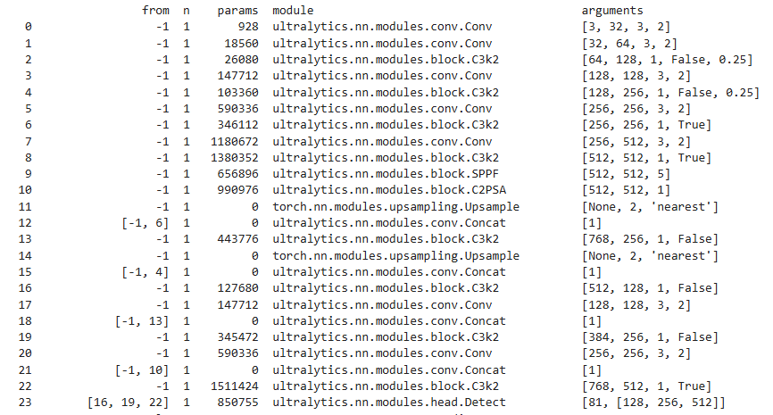

# 🛸Few-Shot Object Detection for Aerial Images

**Research and implementation of transfer learning approach for few-shot object detection in aerial images**

## 📋 Abstract

This is a simple demo of applying Transfer Learning to Few-Shot Object Detection in drone imagery. This demo experiments with combining a pre-trained [YOLOv11s](https://docs.ultralytics.com/vi/tasks/detect/#models) model on the [COCO](https://cocodataset.org/#home) dataset with fine-tuning techniques and SAHI (Slicing Aided Hyper Inference) algorithm to explore the capability of recognizing new objects with limited training data.

**📓 This demo runs with Jupyter notebook on Kaggle - Full implementation available in `fewshot-aerial-detection.ipynb`**

 🚀 **Click to open on Kaggle with pre-imported dataset!**

## 🎯 Overview

### 🔍 Research Problem

Few-Shot Object Detection in aerial imagery presents significant challenges due to:

-   Extremely limited training data for new object classes
-   Small object sizes in drone imagery making detection difficult
-   Requirements to maintain performance on previously learned object classes

### 🛠️ Approach

This study applies a three-stage transfer learning strategy:

1. **🏗️ Initialization**: Using YOLOv11s model pre-trained on [COCO](https://cocodataset.org/#home) dataset (330k+ images)
2. **🎨 Selective Fine-tuning**: Re-training on [miniCOCO](https://universe.roboflow.com/detectionnienluan/ms-coco-2017-xy2sy) combined with new few-shot data
3. **⚡ Inference Optimization**: Integrating SAHI to improve small object detection capabilities

## 🧠 Methodology

### 🏗️ Model Architecture

This study uses [YOLOv11s](https://docs.ultralytics.com/vi/tasks/detect/#models) model as backbone with the following specifications:

-   **Training epochs**: 50 epochs with early stopping
-   **Freezing strategy**: Freeze first 10 layers of backbone
-   **Freezing rationale**: Preserve optimized weights from COCO pre-training, allowing the model to focus on learning high-level features in Neck and Head layers

### 🔄 Transfer Learning Strategy

The transfer learning process follows these principles:

-   **🎯 Feature Extraction**: Early backbone layers learned basic features from COCO
-   **🎨 Fine-tuning**: Only adjust final layers to adapt to new objects
-   **🛡️ Catastrophic Forgetting Prevention**: Maintain performance on 80 original classes by continuing training on miniCOCO

## 📊 Dataset

### 🗂️ Data Structure

The experimental dataset includes:

| Data Source                                                                    | Classes | Images    | Description                                        |
| ------------------------------------------------------------------------------ | ------- | --------- | -------------------------------------------------- |
| [miniCOCO](https://universe.roboflow.com/detectionnienluan/ms-coco-2017-xy2sy) | 80      | 1,405     | COCO subset with all original classes              |
| Few-shot 'bush'                                                                | 1       | 20        | Real drone imagery data - [see details](bush-imgs) |
| **Total**                                                                      | **81**  | **1,425** | Combined dataset for training                      |

### 📈 Data Split

Applying standard splitting methodology:

-   **Training set**: 80% (1,119 images)
-   **Validation set**: 10% (153 images)
-   **Test set**: 10% (153 images)

### 🌿 Few-shot Data Characteristics

-   **Object class**: Bush objects in aerial imagery
-   **Sample size**: 20 drone images
-   **Challenges**: Relatively small objects, overhead view perspective

## 🔪 SAHI - Slicing Aided Hyper Inference

### ⚙️ Working Principle

SAHI (Slicing Aided Hyper Inference) is an advanced framework designed to address the challenge of detecting small objects in high-resolution images.

### 🔄 Processing Pipeline

1. **🔪 Slicing**: Divide original image into small overlapping tiles
2. **🎯 Inference**: Perform object detection on each tile
3. **🧩 Merging**: Combine results from tiles and remove duplicate detections
4. **✨ Post-processing**: Apply global Non-Maximum Suppression (NMS)

### 🚁 Advantages in Aerial Imagery

-   **🔍 Small Object Detection**: Improves accuracy for objects occupying < 2% of image area
-   **📸 High-Resolution Processing**: Can handle 4K+ drone imagery
-   **💾 Resource Optimization**: Reduces GPU memory requirements during inference

## 📊 Experimental Results

### 🧪 Experimental Design

Due to time constraints, experiments were conducted on a single drone test image not included in the training set to evaluate the effectiveness of each stage in the pipeline.

### 📈 Results Analysis

| Model                     | Detection Performance | Notes                                             |
| ------------------------- | --------------------- | ------------------------------------------------- |
| **Base Model** (a)        | Poor                  | Completely failed to detect bush objects          |
| **Fine-tuned Model** (b)  | Fair                  | Detected some objects but with missing detections |
| **Fine-tuned + SAHI** (c) | Best                  | Detected most objects in the image                |

### 💡 Observations

1. **🔴 Base model**: Completely failed to recognize the new 'bush' class
2. **🟡 Fine-tuned model**: Significant improvement but missed small objects
3. **🟢 Fine-tuned + SAHI**: Achieved best performance, especially for small objects

### 📝 Conclusion

Due to time and resource limitations, this is just a small demo with many shortcomings. However, through this experiment we can observe:

-   **🔄 Transfer Learning** shows potential in helping models learn new features with limited data
-   **🔪 SAHI** can improve small object detection capabilities in drone imagery
-   **🤝 The combination** of both techniques shows promising development direction

## 🚀 Future Work

-   📈 Expand experiments on larger test sets
-   🎯 Experiment with multiple few-shot object classes
-   ⚙️ Optimize SAHI hyperparameters
-   ⚡ Optimize for real-time performance

## 🙏 Acknowledgments

Thank you for taking the time to view this demo! Although it's simple and has much room for improvement, we hope it provides some useful insights.

Have a wonderful day! 🌟
